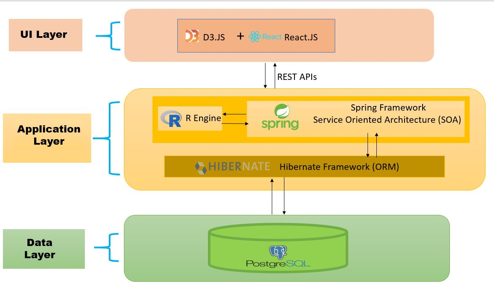
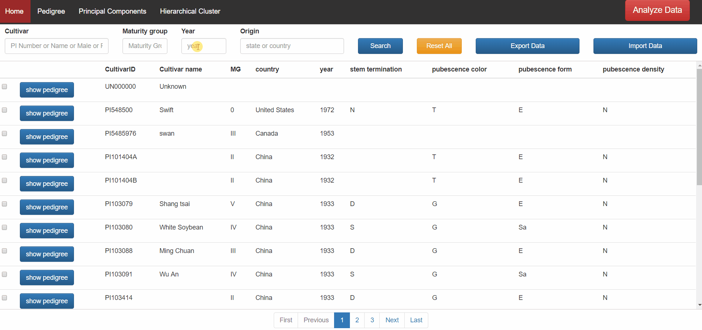
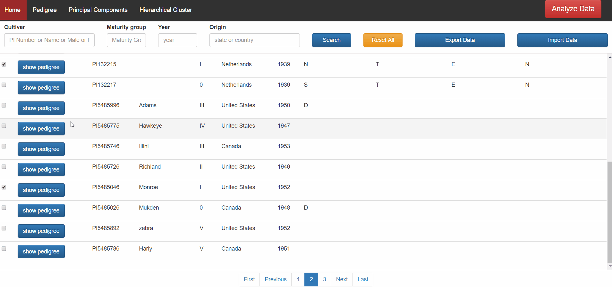
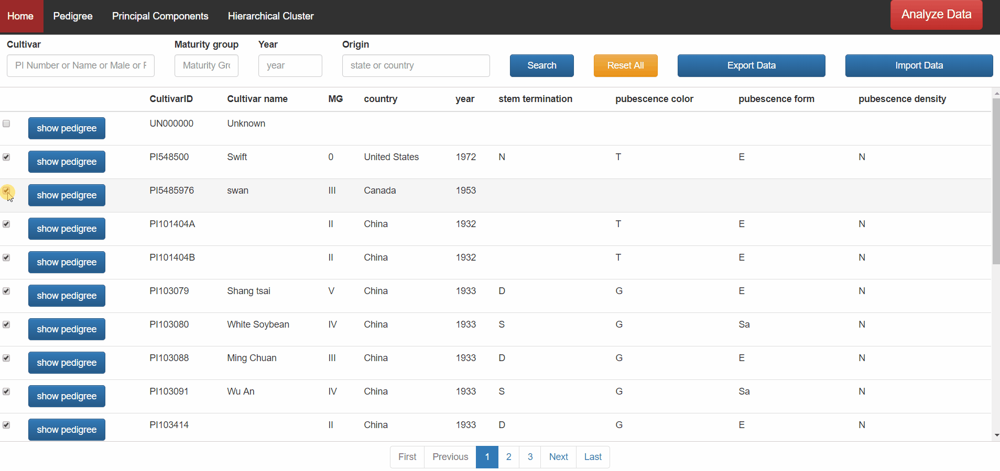
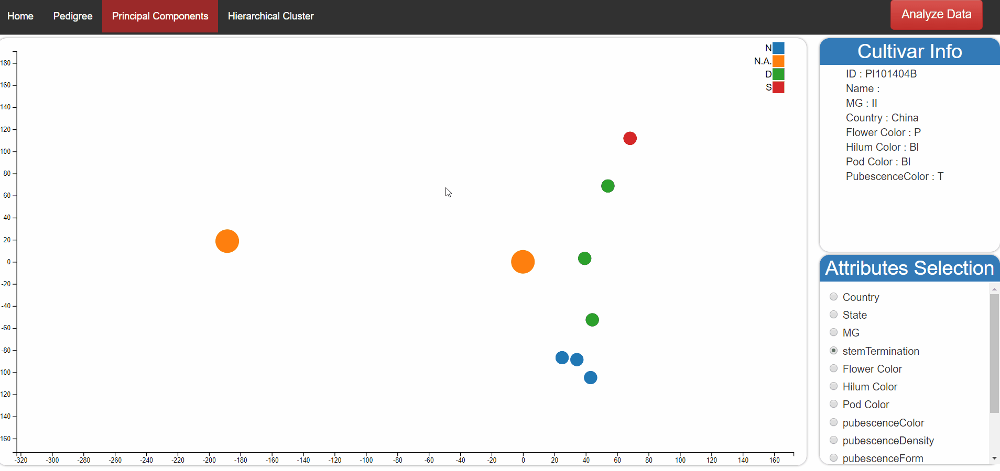
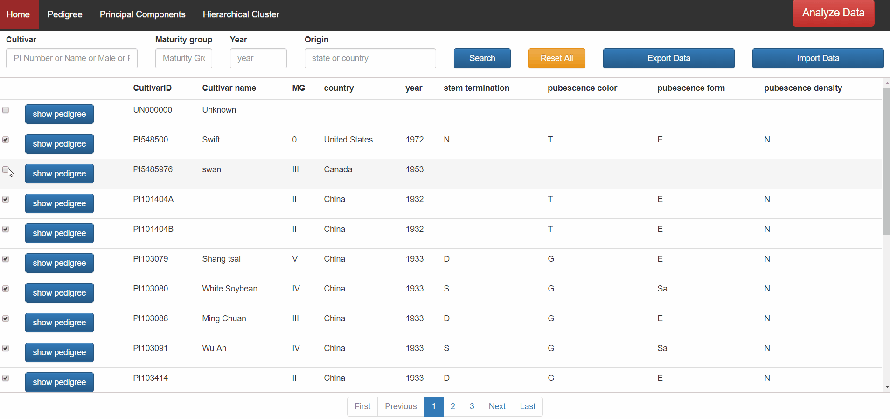
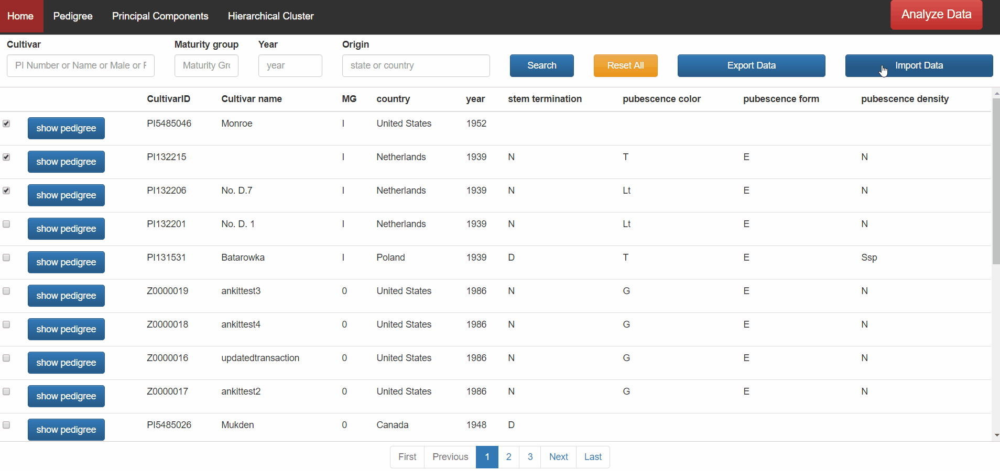
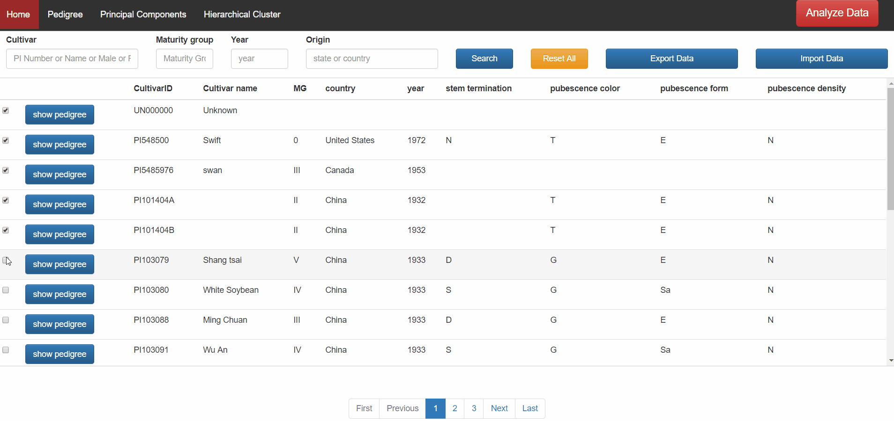

<strong><em>Abstract</em></strong>

<strong><em>MaxPedigree</em></strong><strong> v2.0</strong> is a web-based analytics and visualization tool for soybean plant breeders. It empowers plant breeders with a fast, reliable, and secure one-stop platform for their multiple analysis and visualization needs. Core functionalities include pedigree visualization, principal component analysis (PCA) of SNP data, SNP/cultivar data validation, Storage/retrieval of SNP data, colorful traits visualization of data and hierarchical clustering. It also provides an interactive search to easily access the pedigree and traits of existing and historical cultivars/breeding lines for both parental and progeny selection. All the information is stored in a secured RDBMS database. Although MaxPedigree is developed for Soybean plant, once established, could also be applied to other crops such as maize, cotton, peanut, and wheat.

Click here for Version 1.0 : <a href ="https://github.com/ankitjoshi14/maxpedigree1.0"> MaxPedigree v1.0 </a>

<strong><em>System Architecture</em></strong>

<strong><em>Features &amp; User Guide</em></strong>

MaxPedigree bundles multiple features in one platform. Data analysis and visualization are at its core. Besides those, there are some addon features. Below is the comprehensive list of all the features with details and usage.

<u>Data Selection Tab:</u>

This feature let the user lookup Cultivar database using the interactive search bar in a nice and easy to navigate tabular format. Pagination is also provided to let the user browse through hundreds of records with no Hassle. To refine the search, the user can make use of the search bar. Each data row is provided with a checkbox to let the user select the cultivar for data analysis.

<u> Search Bar:</u>

Cultivar data can have thousands of records. The user can take help of search bar to refine the search results. MaxPedigree provides four search criteria for this purpose.

Valid input values for each criterion.

<ul>
<li>PI number: PI number/ Cultivar Name/Male parent name/Female parent name</li>
<li>Country: Country of origin or state/province</li>
<li>Year: Origin year</li>
<li>Maturity group</li>
</ul>

Al the search inputs are based on START WITH matching criteria instead of exact search. For instance, for PI number PI3454, matching records would be PI345445, PI3454533, PI3454434 and so on. The user can also reset search results by using reset all button.

<u>Attribute selection and color tracing:</u>

This feature let user color nodes in PCA and edges in the pedigree tree based on the selected attribute. This feature helps the user to color trace selected attribute in the pedigree tree and gives extra information about nodes.

To color, select desired attribute from attribute box at the right bottom of the screen.

<u>Pedigree Tree:</u>

This feature will help the user to visualize the ancestry tree of a cultivar. Tree edges can be colored based on selected trait from attribute box.

 To use this feature, follow the below steps:

<ul>
<li>open data tab from the top navigation bar.</li>
<li>Search for Cultivar using the search bar or simply scroll through data table.</li>
<li>Click the show pedigree button provided in the desired cultivar data row.</li>
<li>To color trace a trait, select it from attribute selection box.</li>
</ul>

&nbsp;

<u>Principal Component analysis (PCA):</u>

This feature will let the user do a principal component analysis of selected cultivars. The nodes can be colored based on the selected attribute. There is also an add-on feature for highlighting selected cultivar. The user can toggle the size of a node by clicking on it. This feature let user highlight specific node. To check out the details of each node, the user can hover over that node. The user can also zoom in, zoom out and drag the generated datapoints.

Zooming and Dragging feature

To perform PCA, follow below steps:

<ul>
<li>Open data tab from the navigation</li>
<li>Selected cultivar from Data table for which you want to perform PCA.</li>
<li>Click on Analyze data given the right side of the navigation This will open a pop up showing selected cultivar in a text area.</li>
<li>The user can move forward with selected cultivar or edit the text area to add few more cultivars manually.</li>
<li>Now click PCA button to perform PCA. This will perform PCA on all the valid cultivars and ignore invalid cultivars.</li>
<li>In a PCA tab, the user can toggle the size of any node</li>
<li>To change the colors of the node, selected the desired attribute from the attribute selection box.</li>
</ul>

NOTE- Cultivars with no SNP information in the database will be ignored while performing PCA.

<u>Hierarchical Clustering:</u>

This feature will let user generate Hierarchical Cluster for selected cultivars. This follows the same procedure same PCA. The user can zoom in, zoom out and drag the Hierarchical Cluster. 

To perform Hierarchical Clustering, follow below steps:

<ul>
<li>Open data tab from the navigation</li>
<li>A selected cultivar from Data table for which you want to perform PCA.</li>
<li>Click on Analyze data given the right side of the navigation This will open a pop up showing selected cultivar in a text area.</li>
<li>The user can move forward with selected cultivar or edit the text area to add few more cultivars manually</li>
<li>Now click HCluster button to perform Hierarchical Clustering. This will perform Hierarchical clustering on all the valid cultivars and ignore invalid cultivars.</li>
</ul>

NOTE- Cultivars with no SNP information in the database will be ignored.

&nbsp;

<u>SNP and physical information Validation:</u>

MaxPedigree let user validate SNP and physical information. The user can validate up to 100 cultivars in a single upload. MaxPedigree accepts CSV format only. It also displays validation response message to let user correct incorrect information and reupload again. MaxPedigree can also validate a cultivar with missing SNPs. The user can also upload incomplete SNP information. For instance, sometimes a specific cultivar does not have SNP information for all 40,000 SNPs. A cultivar with lesser SNPs (&lt; 40,000) will also be validated. Uploaded SNPs can follow any sequence. 

To validate SNP or physical information, follow below steps:

<ul>
<li>Go to the Data tab and click on import data button given in the search</li>
<li>Select a file to upload. A file can contain up to 100 cultivars information</li>
<li>Select File type (SNP or cultivar) and Upload type (validate or validate and upload)</li>
<li>Click on upload.</li>
<li>Review the upload results.</li>
</ul>

NOTE- Always use CSV file with correct headers. Download template file for hassle free upload. Validation of data stops at the first occurrence of incorrect cultivar information. For instance, if the uploaded file has an incorrect value in the first row itself then no further validation will occur, and validation failed response will be sent with correction hints in the upload results area.

<u>Data Import:</u>

This feature follows the same procedure as Validation. MaxPedigree uploads data only if the information is correct for all the cultivars. For instance, If a user uploaded an SNP information file having 50 cultivars. Data will be persisted in the database only if all the 50 cultivars are validated successfully. Even if 49 cultivars are correct but 50th cultivar is uploaded with incorrect values, MaxPedigree will reject upload for all Cultivars.

NOTE - One Important feature of Data Export for Cultivar Data is that it updates the data rows having Cultivar Id and create new ID (starting with &ldquo;Z00000&rdquo;) if Cultivar ID is empty.

&nbsp;

<u>Data Export:</u>

This feature let user export the cultivar physical or SNP information in CSV format. The export feature can export up to 100 cultivar information.

 To export data, follow below steps:

<ul>
<li>Go to the data tab and select cultivars from the table.</li>
<li>Click on export data. It will open a popup window.</li>
<li>Popup window will let user review and edit select cultivar list.</li>
<li>Click on the desired type of information (SNP or Physical) to download.</li>
</ul>
